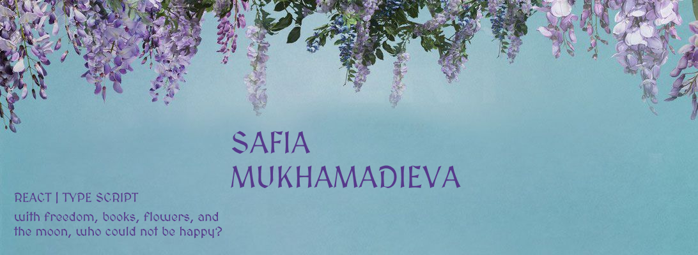

  
  
  
  
  
  
  
  
  
  
  
  
  

## 

* Beginner **Frontend Developer** focused on building web interfaces with React, TypeScript, JavaScript, HTML, and CSS.
* Interested in clean UI, responsive layouts, component-based development, and practical frontend architecture.
* Have basic programming knowledge with OOP, API concepts, Git, and Docker.
* Currently studying and developing my skills through education and personal practice.

---

## 

| Category | Skills |
|---|---|
| Frontend | React, TypeScript, JavaScript, ES6, HTML, CSS3, Tailwind |
| State Management | Zustand |
| Build Tools | Vite |
| Programming Basics | OOP, API |
| Tools | Git, Docker |
| Languages | Russian, English |

---

## Education

* **Ulyanovsk State Technical University**  
  Sept. 2023 - June 2027 (Expected)  
  Bachelor in Software Engineering - Artificial Intelligence and Predictive Analytics track

---

## Currently Learning

* Modern React development
* TypeScript in frontend projects
* Working with APIs
* Improving English for IT communication

---

## 

<strong>harmony-hub</strong> — Music player with a real-time audio visualizer

 

Harmony Hub is a frontend music player for uploading, organizing, and playing tracks with a real-time sound wave visualizer. The project focuses on custom playback controls, playlist management, and interactive audio visualization rendered on Canvas.

The application is built with React, Web Audio API, and Tailwind CSS. It uses browser audio processing capabilities to analyze sound data during playback and display dynamic waveforms in real time. The project can be extended with free music APIs such as Free Music Archive or Jamendo API for browsing and loading audio content.

**Links:**

* [GitHub Repository](https://github.com/wuliiao/harmony-hub)

---

## 

- **EF SET English Certificate (C1)**  
  Date: June 2026  
  Accreditation ID: 68/100 (C1)  
  Verify: https://cert.efset.org/ru/zUa2mP

---

## Contacts

  <a href="https://github.com/wuliiao">GitHub</a> |
  <a href="https://t.me/wuliiao">Telegram</a> |
  <a href="mailto:safija2005@gmail.com">Email</a>

